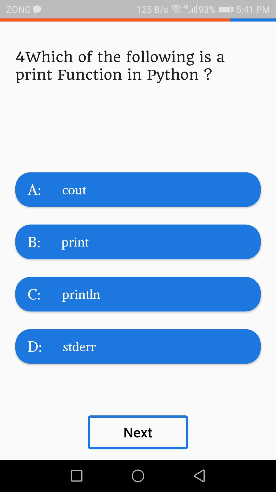
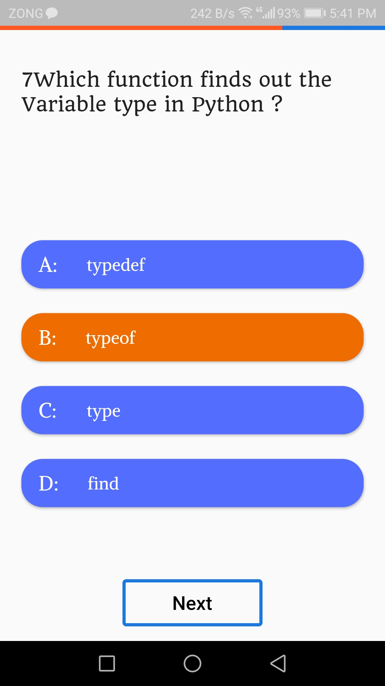
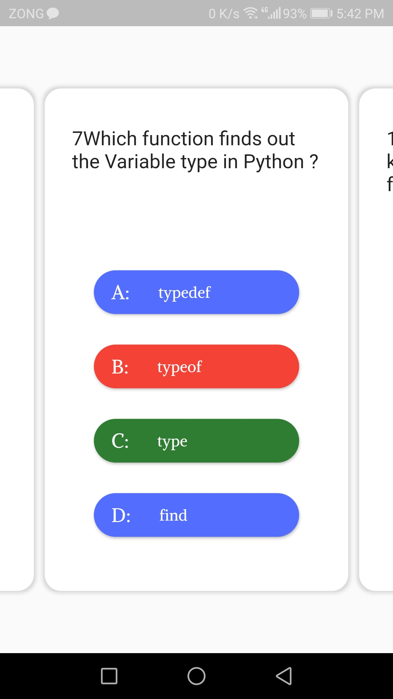
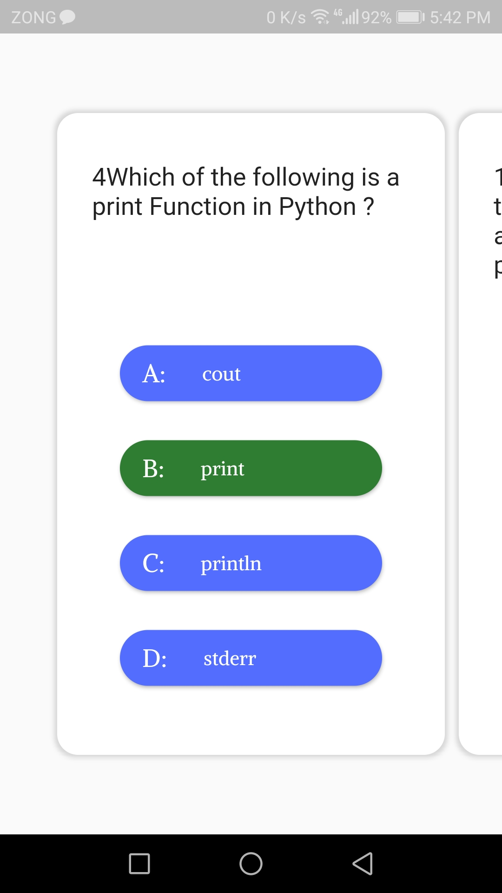

# MyQuizApp-Flutter
> Mobile App Development Assignment Before 2nd Sessional

## Features:

* Multiple Screens
* Start With Splash Screen.
* Each Question has 30 Second as Default.
* Pick Random Questions.
* Automaticaly move to Result After Time Complete.
* Button Color Changes On Click.
* Result Page (Show Score)
* Category Options ( Update Soon)
* Review Page - All Questions show with Right Answer and Wrong answer

## ScreenShots:
<kbd></kbd>
<kbd></kbd>
 <kbd> </kbd>
 <kbd> </kbd>
 <kbd> </kbd>
 <kbd> </kbd>
 <kbd> </kbd>
 
 

 For Upcoming Apps, Follow me 
[`umairnawaz333`](https://github.com/umairnawaz333) 
